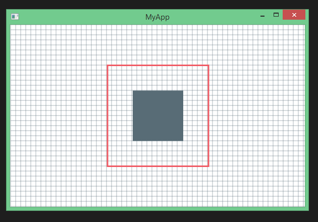

# Direct2D from Rust

A simple yet very unsafe example to demonstrate how to use Direct2D from rust. Window creation and all that stuff is also included.

### Pretty picture

### Requirements

 - Lastest version of rust nightly (MSVC ABI) 
 - Only tested on 64bits
 - winapi 
 - user32-sys 
 - kernel32-sys 

### Note
This example is heavily inspired from this tutorial:
https://msdn.microsoft.com/en-us/library/windows/desktop/dd370994%28v=vs.85%29.aspx

